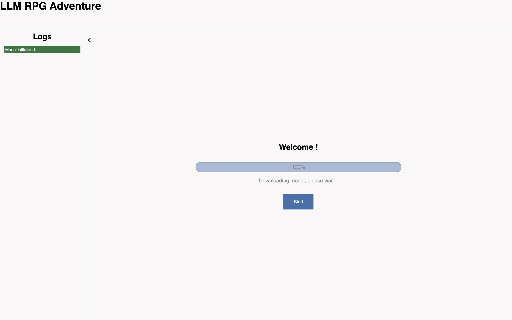
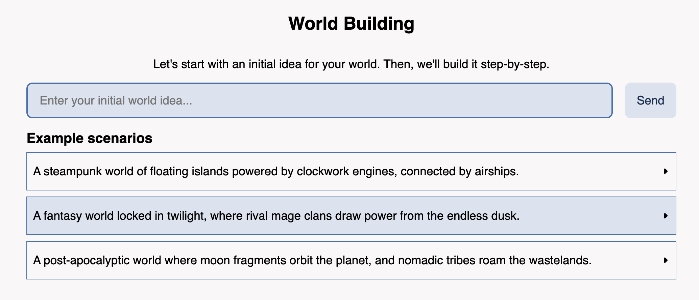
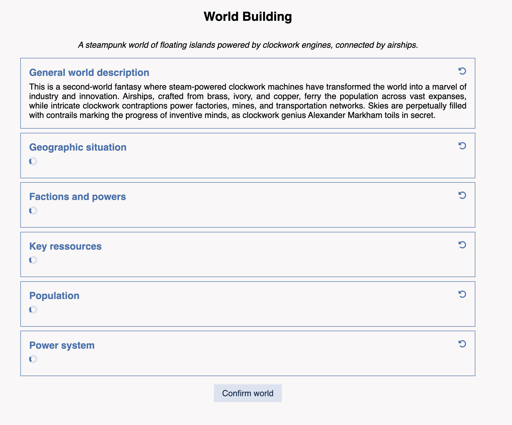
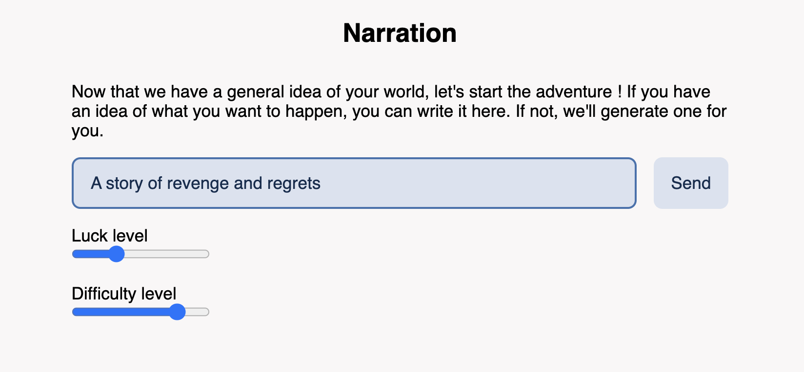
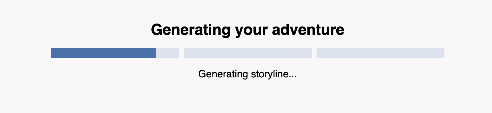
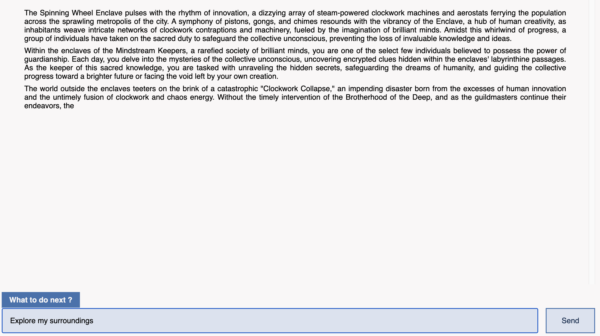
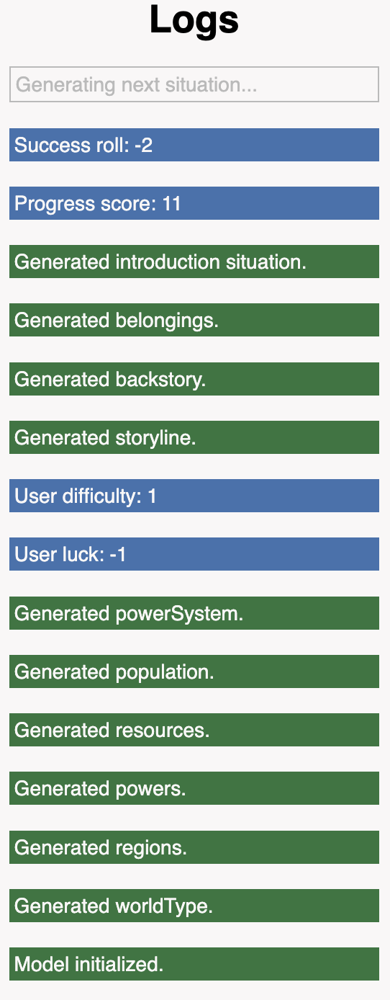
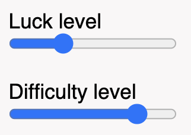

# LLM-Powered RPG Adventure

Welcome to **LLM-Powered RPG Adventure**, a text-based interactive game that leverages large language models (LLMs) to dynamically generate worlds, stories, and player-driven narratives. This project allows players to immerse themselves in a richly detailed adventure by combining AI-generated content with user choices.

## Features

- **Dynamic World Generation**: Create a unique world tailored to your input, including regions, factions, resources, and populations.
- **Interactive Narration**: Progress through your adventure with turn-by-turn narrative scenes, complete with user-driven actions.
- **Customizable Scenarios**: Start with your own scenario idea or choose from provided examples.
- **Advanced Game Mechanics**: Includes a luck and difficulty system to influence the outcomes of your actions.
- **Rich Logs**: View a detailed log of actions and story progress in the sidebar.
- **Built-in Markdown Rendering**: Experience immersive storytelling with bold text and structured layouts.

## File Structure

- **index.html**: The main HTML file for the game UI.
- **style.css**: Stylesheet for the game layout and design.
- **script.js**: Core script that initializes the game and handles user interactions.
- **scripts/**: Folder containing modular JavaScript files for various game features:
  - `generator.js`: Manages the LLM initialization and response generation.
  - `ui.js`: Handles UI-related functions such as toggling views and updating logs.
  - `worldbuilding.js`: Generates world-building elements like regions and factions.
  - `scenario.js`: Creates storylines, backstories, and belongings.
  - `narration.js`: Handles turn-by-turn storytelling and the final conclusion.
  - `markdown.js`: Converts simple Markdown to HTML for story rendering.
  - `gameMechanics.js`: Implements game rules such as dice rolls for success/failure.
- **assets/**: Icons and other media files.

## Step-by-Step Explanation of the Code

### 1. Model Loading

- The application initializes by loading the LLM model `onnx-community/Llama-3.2-1B-Instruct-q4f16` using the Hugging Face Transformers pipeline with WebGPU.
- Unfortunately, the Transformers library does not provide a way to track the download progress of the model, so the progress bar is static until the model is fully loaded. Once loaded, the UI updates to indicate the model is ready.

### 2. World Idea and World Building Steps

- Players provide a world idea via text input or select a pre-defined scenario from the examples.

- The world-building process is sequential, with each step depending on the previous one as context. For example, regions are generated after the world type is defined, and powers/factions are influenced by the regions.
- The following details are generated in order:
  - **World Type**: The overall theme and structure of the world.
  - **Regions**: Geographic and environmental descriptions.
  - **Factions**: Key powers or factions operating in the world.
  - **Resources**: Identifies one abundant and one scarce resource.
  - **Population**: Defines distinct population groups.
  - **Power System**: Outlines how abilities or levels work in the world.

After the world is generated, the user can click on the reload icons to regenerate a part of the world if they are not satisfied with it. The elements that are generated using that reloaded element are also then regenerated.

### 3. Narration Idea and Generation

- Players provide an initial story idea (or leave it blank for random generation).

- The narration system follows these steps:
  - **Storyline**: Generates a structured synopsis of the adventure, the initial situation, and the main quest objective.
  - **Character Backstory**: Builds a concise backstory based on the storyline and world context.
  - **Initial Belongings**: Provides a list of starting items for the character.

### 4. Situation System

- The adventure progresses through a series of situations:
  - **Introduction**: The first situation is generated with a dedicated prompt, describing the world, the character's state, and the immediate environment.
  - **New Situations**: For each turn, a random number is rolled from a normal distribution (to make sure important situation are rarer than common ones) to determine the significance of the next situation (positive for good outcomes, negative for bad outcomes). This roll outcome is passed as context to the situation generation prompt.
  - **End Situation**: When the progress score reaches or exceeds a threshold, the game concludes with a final scenario tailored to the player’s choices and roll outcomes.

### 5. Win Condition System

- A **progress score** tracks how close the player is to completing the story.
- Every new situation increases the progress score, with the increment proportional to the magnitude of the roll outcome. This system ensures that critical events, whether positive or negative, bring the story closer to its resolution.
- When the progress score reaches 20 (arbitrary value), we generate the final situation text that wraps up the story.

### 6. Sidebar Logs

- To address the long generation times, a sidebar displays a log of important events, showing players the progression of world-building and narration steps.
- The sidebar can be toggled on or off for accessibility, ensuring the UI remains clean while still providing useful feedback.

### 7. Luck and difficulty

- To allow for further user customization, a **luck** and **difficulty** setting is offered when prompting the adventure story idea. These 2 parameters are represented as integer going from `-5` to `+5`. How these 2 values impact the game is through the random number generated when creating a new situation. This random number represent the impact of the new situation on the story and is pooled from a **normal distribution**.
- The **luck** parameter impacts the **mean** of the distribution, so the average roll of the random number generator. Higher luck means a bigger chance to get a positive roll.
- On the other hand, the **difficulty** parameter represents the **standard deviation** of the distribution, and impacts the variance of the roll. Higher difficulty means more volatile results from the roll. A high difficulty means more extreme rolls.

## Model and Frameworks

- **Model**: `onnx-community/Llama-3.2-1B-Instruct-q4f16` loaded via Hugging Face Transformers with WebGPU.
- **Frameworks**: JavaScript modules for modular and reusable components.

## Limitations

- **Performance**: The LLM model may require significant GPU resources.
- **Model Size**: Large models can delay loading times or fail on devices with limited memory.
- **Browser Compatibility**: Ensure your browser is WebGPU-compatible.

## Contributions

Every part of the project is custom made by me. Few shot examples were generated using GPT-4o to ensure a quality of examples, and edited to fit the expected format. The markdown to HTML function comes from _drawdown.js _ (c) by Adam Leggett\*.

## License

This project is licensed under the [MIT License](LICENSE).

---

Enjoy your adventure in LLM-powered storytelling!
